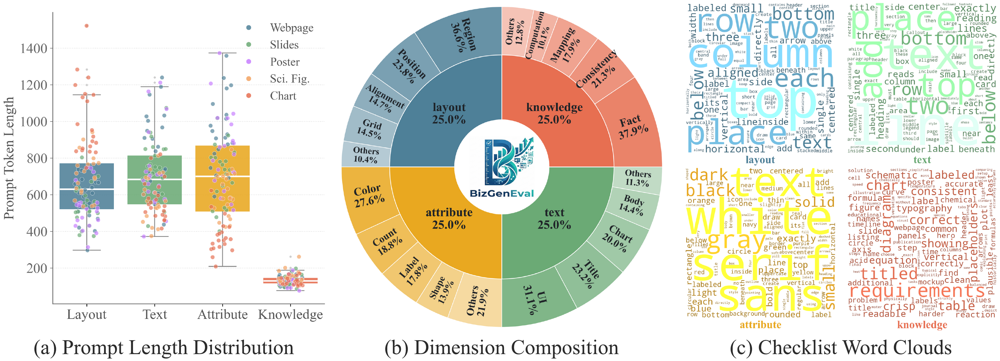
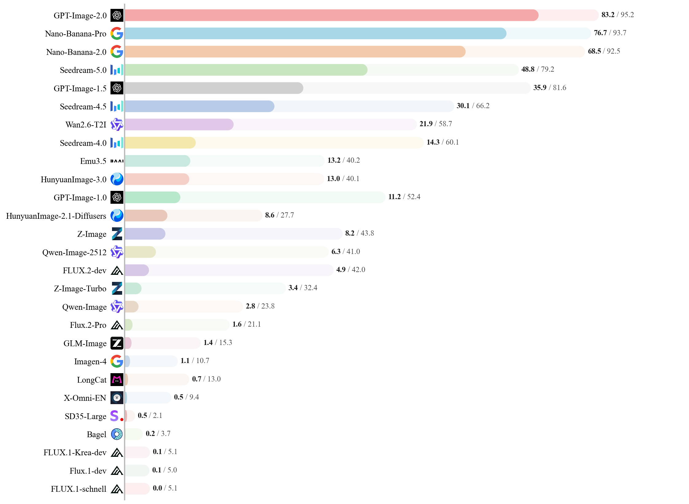

<div align="center">

# BizGenEval

### A Systematic Benchmark for Commercial Visual Content Generation

<p>
  <a href="https://arxiv.org/abs/2603.25732"></a>
  <a href="https://aka.ms/BizGenEval"></a>
  <a href="https://huggingface.co/datasets/microsoft/BizGenEval"></a>
  <a href="https://huggingface.co/spaces/microsoft/BizGenEval-Leaderboard"></a>
</p>

<p>
  Benchmarks real-world commercial design generation under dense visual, textual, and semantic constraints across layout fidelity, text rendering, attribute binding, and knowledge reasoning.
</p>

</div>

---

## Overview

BizGenEval is a systematic benchmark for evaluating image generation models on real-world commercial design tasks. Unlike benchmarks centered on natural-image synthesis, it targets structured scenarios with dense text, precise layouts, multiple visual elements, and strict semantic constraints.

It covers **5 document types** (slides, charts, webpages, posters, scientific figures) × **4 capability dimensions** (text rendering, layout control, attribute binding, knowledge reasoning) = **20 evaluation tasks**, with **400 curated prompts** and **8,000 human-verified binary checklist questions**.


<p align="center">
  
</p>


## Main Results

We benchmarked **26 state-of-the-art models**, including leading commercial APIs and open-source models, to understand how current systems handle structured design tasks. 

<p align="center">
  
</p>

**Key Findings:**

- **Uneven Domain Proficiency:** Models perform reasonably well on aesthetics-driven domains (Slides, Webpages, Posters) but struggle significantly with the strict precision demands of informative domains (Charts, Scientific Figures).
- **Persistent Capability Gaps:** While text rendering and knowledge reasoning are advancing rapidly, precise layout control and multi-attribute binding remain universal bottlenecks.
- **Domain-Specific Generalization:** Strong performance on standard natural-image benchmarks does not reliably translate to competence in professional commercial design tasks.

---

## Get Started

### Installation

Set up the environment with:

```bash
conda create -n bizgeneval python==3.12 -y
source activate bizgeneval
pip install -r requirements.txt
```

### Dataset Format

Each entry in `assets/bizgeneval.jsonl` follows this schema:

```json
{
  "id": 0,
  "prompt": "Generate a slide with ...",
  "domain": "slides|webpage|chart|poster|scientific_figure",
  "dimension": "layout|attribute|text|knowledge",
  "aspect_ratio": "16:9",
  "reference_image_wh": "2400x1800",
  "questions": ["question_1", "question_2", "..."],
  "eval_tag": "key_in_EVAL_GENERATION_PROMPTS",
  "easy_qidxs": [1, 2, 3],
  "hard_qidxs": [4, 5, 6]
}
```

- `questions`: 20 binary verification questions associated with the prompt.
- `easy_qidxs` / `hard_qidxs`: difficulty split for the questions, with 10 easy and 10 hard checks per prompt.

### Pipeline Overview

| Step | What it does | Output |
|---|---|---|
| 1. Generate | Generate images from benchmark prompts | generated image files |
| 2. Evaluate | Evaluate generated images against checklist questions | per-image evaluation JSON files |
| 3. Summarize | Aggregate evaluation results by domain and dimension | summary CSVs and JSON |

### Step 1: Image Generation

See `config/generation_config.yaml` for model configuration, then run:

```bash
python -m generation.image_generation \
    --data_path assets/bizgeneval.jsonl \
    --save_dir outputs/generated_images \
    --resolution_mode dynamic_original \
    --skip_existing
```

The `--resolution_mode` controls how output image dimensions are determined: `config` uses the fixed size from your YAML, `dynamic_original` matches the dataset's reference resolution (snapped to the model's stride), and `dynamic_max_pixels` scales it down to fit a pixel budget.

You can integrate your own models by extending `generation/models.py`, i.e., add a loading branch in `load_model()` and a corresponding generation method, then register it in `generate_image()`.

### Step 2: Evaluation

BizGenEval uses Gemini as an automated multimodal evaluator to answer checklist questions over generated outputs.

Set your Gemini API key, then run:

```bash
export GEMINI_API_KEY="your-api-key"

python -m evaluation.image_evaluation \
    --data_path assets/bizgeneval.jsonl \
    --img_dir outputs/generated_images \
    --save_dir outputs/eval_results
```

| Argument | Description |
|---|---|
| `--only_domain` | Filter by domain (e.g. `slides webpage`) |
| `--only_dimensions` | Filter by dimension (e.g. `attribute layout`) |
| `--force_rerun` | Re-evaluate even if results already exist |
| `--debug` | Enable debug output |

The evaluation supports **resume** — existing result files are skipped automatically unless `--force_rerun` is specified.

- Scores are reported for `easy`, `hard`, and `all` subsets.
 Each track uses a penalty-based rule: $score = \max(0, 1 - \alpha \cdot N_{\text{errors}})$.

### Step 3: Summary

After evaluation, generate summary CSV tables:

```bash
python -m evaluation.summarize \
    --data_path assets/bizgeneval.jsonl \
    --result_dir outputs/eval_results \
    --save_dir outputs/summary
```

This produces:

- `summary_by_domain.csv` — scores grouped by domain (slides, webpage, etc.)
- `summary_by_dimension.csv` — scores grouped by dimension (layout, attribute, etc.)
- `summary.json` — full summary with per-group statistics

Each CSV includes rows for `easy`, `hard`, and `all` subsets.

## Citation

If you find this project useful, please consider citing:

```bibtex
@misc{li2026bizgeneval,
      title={BizGenEval: A Systematic Benchmark for Commercial Visual Content Generation},
      author={Yan Li and Zezi Zeng and Ziwei Zhou and Xin Gao and Muzhao Tian and Yifan Yang and Mingxi Cheng and Qi Dai and Yuqing Yang and Lili Qiu and Zhendong Wang and Zhengyuan Yang and Xue Yang and Lijuan Wang and Ji Li and Chong Luo},
      year={2026},
      eprint={2603.25732},
      archivePrefix={arXiv},
      primaryClass={cs.CV},
      url={https://arxiv.org/abs/2603.25732},
}
```
